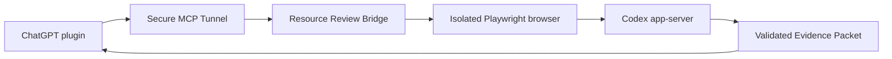

# Resource Review Bridge

A small, read-only MCP server that lets ChatGPT inspect public Instagram, Threads, and web resources through a local browser, then return a schema-validated Evidence Packet.

**Status:** experimental local-first software. It is intended for a single user, not as a hardened multi-tenant crawling service. This project is not affiliated with Instagram, Threads, Meta, or Notion.

It is designed for a simple research workflow:

1. acquire the public source;
2. separate direct evidence from promotional claims;
3. discuss whether the resource is useful;
4. save it elsewhere only after explicit user approval.

## Why this exists

Public social posts are often awkward for an AI chat to inspect reliably: login reminders obscure otherwise public content, carousels require navigation, and repeated attempts can fill the conversation with duplicated or irrelevant page text. Resource Review Bridge performs bounded acquisition first and sends a compact, structured Evidence Packet into the reasoning step.

The goal is to reduce wasted context and repeated failed attempts, which can improve token efficiency. It does not guarantee lower token use: screenshots, long captions, large carousels, and detailed evidence still consume model context.



## What it does

- Exposes one MCP tool: `review_resource`.
- Accepts public `http` and `https` URLs only.
- Rejects credentials, localhost, private IPs, and non-web schemes.
- Uses an unsigned-in, temporary Playwright browser context.
- Dismisses non-blocking Instagram Close/X login reminders.
- Attempts one safe backdrop dismissal for a Threads login overlay.
- Reads up to 12 carousel items, a bounded visible comment set, and 3 direct outbound pages.
- Preserves the visible original caption in a dedicated `caption` field without reconstructing missing text.
- Returns a strict Evidence Packet with claims, evidence IDs, read states, and limitations.
- Allows one active job, two bounded attempts, idempotent request IDs, and 24-hour local retention.
- Runs Codex in a read-only sandbox without interactive approvals.

## Requirements

- Python 3.9 or newer.
- Node.js and npm.
- A local Codex executable, either on `PATH`, supplied with `RESOURCE_REVIEW_CODEX`, or bundled with the ChatGPT macOS app.
- Access to [OpenAI Secure MCP Tunnels](https://developers.openai.com/api/docs/guides/secure-mcp-tunnels) for ChatGPT integration.

The repository does not include Tunnel, Cloudflared, browser, or Codex binaries.

## Local setup

Install the browser dependency:

```bash
npm install
npx playwright install chromium
```

Run the MCP server directly:

```bash
python3 -m resource_review_bridge.server --stdio \
  --state ./work/resource-review-state.sqlite
```

For a Secure MCP Tunnel profile, configure its stdio command as:

```text
/absolute/path/to/resource-review-bridge/scripts/run-resource-review-mcp
```

The wrapper derives the repository location at runtime, creates local state under `work/`, and locates the Codex executable. Keep API keys and Tunnel profiles outside this repository.

## Configuration

| Variable | Purpose |
| --- | --- |
| `RESOURCE_REVIEW_CODEX` | Explicit Codex executable path or command |
| `RESOURCE_REVIEW_NODE` | Explicit Node.js executable path |
| `RESOURCE_REVIEW_PLAYWRIGHT_PATH` | Explicit Playwright package directory |
| `RESOURCE_REVIEW_STATE_PATH` | SQLite state file path |

When no browser variables are set, the bridge checks the repository's `node_modules` first and then common local Codex runtime locations.

## Suggested ChatGPT project workflow

The reusable AI Tools Log instructions are in [prompts/ai-tools-log-project-instructions.md](prompts/ai-tools-log-project-instructions.md). They tell ChatGPT to review evidence first, give a concise judgment, discuss it, and write to Notion only after explicit approval.

## Test

```bash
python3 -m unittest discover -s tests -v
```

Tests use fakes and temporary SQLite files. They do not access the network, private accounts, or model usage.

Inspect the latest terminal job without printing retained evidence:

```bash
python3 -m resource_review_bridge.server --status \
  --state ./work/resource-review-state.sqlite
```

## Recovery and error states

A job left running for more than 15 minutes is changed to `stale_interrupted` before a new job is admitted. Failures after admission always become terminal states:

- browser failure: `acquisition_failed`;
- Codex generation failure: `evidence_generation_failed`;
- schema failure: `invalid_evidence_packet`;
- unexpected failure: `internal_error`.

This prevents a failed review from permanently blocking later requests as `busy`.

## Security and privacy

- The tool is read-only and exposes no general shell or filesystem action.
- Acquired page text is untrusted evidence, never an instruction.
- Downloads, forms, login, likes, comments, follows, and posting are not allowed.
- Local screenshots and SQLite state may contain source content. They are stored outside version control and should be deleted according to your retention needs.
- Snapshot text and screenshots are sent to the user's Codex service for Evidence Packet generation. Review only material you are permitted to process this way.
- The network policy blocks requests to local and private-network addresses before navigation and during browser subrequests.

See [SECURITY.md](SECURITY.md) for disclosure guidance and operational limits.

## Verification status

- Unit tests cover URL policy, packet validation, job recovery, idempotency, error finalization, and the single-tool MCP surface.
- A public Instagram carousel was read after dismissing its login reminder; the caption, carousel, visible comments, and direct links produced a valid Evidence Packet.
- A live Secure MCP Tunnel and ChatGPT plugin request returned the packet to the originating conversation.
- Threads public pages were acquired, but the backdrop-dismiss branch remains code-reviewed rather than live-triggered.

## Known limitations

- Instagram and Threads markup can change without notice.
- Publicly visible comments are bounded and may be incomplete.
- Evidence generation consumes the user's existing Codex allowance.
- The current MCP call remains open until completion. There is no durable MCP Apps completion card for calls that outlive the host request.
- This project does not bypass authentication, paywalls, CAPTCHAs, or access controls.
- Users are responsible for following applicable laws and each source site's terms.

## License

[MIT](LICENSE)
